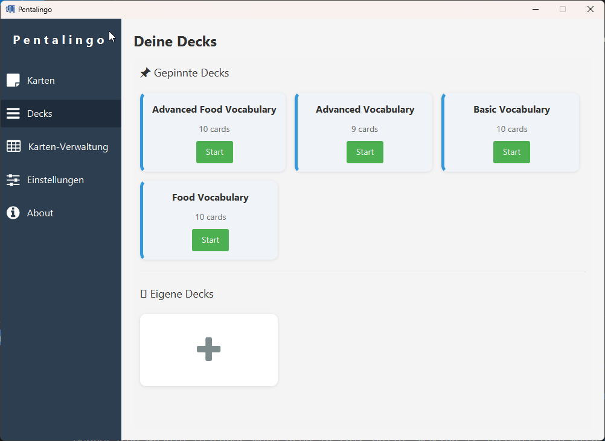
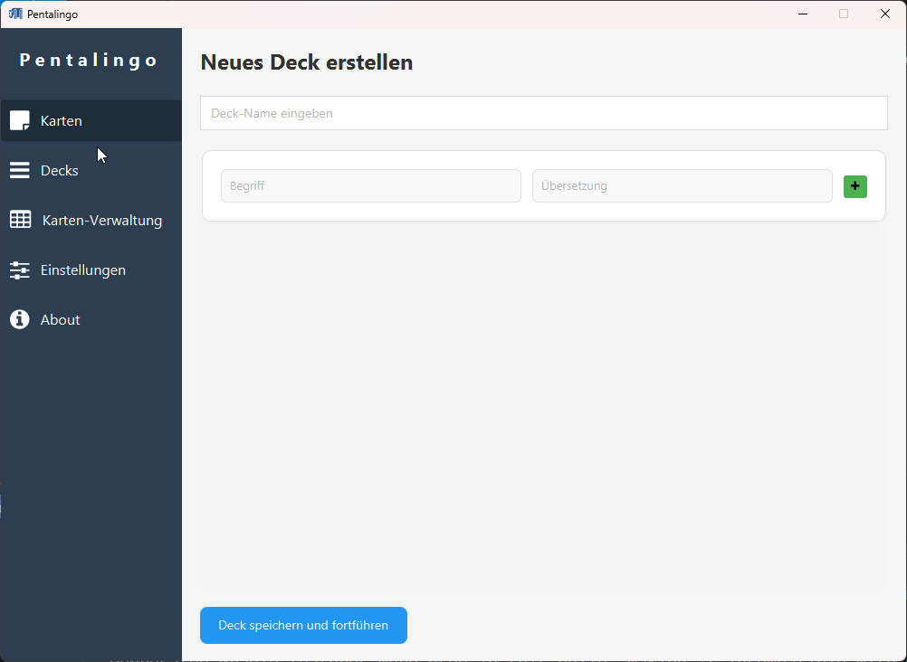
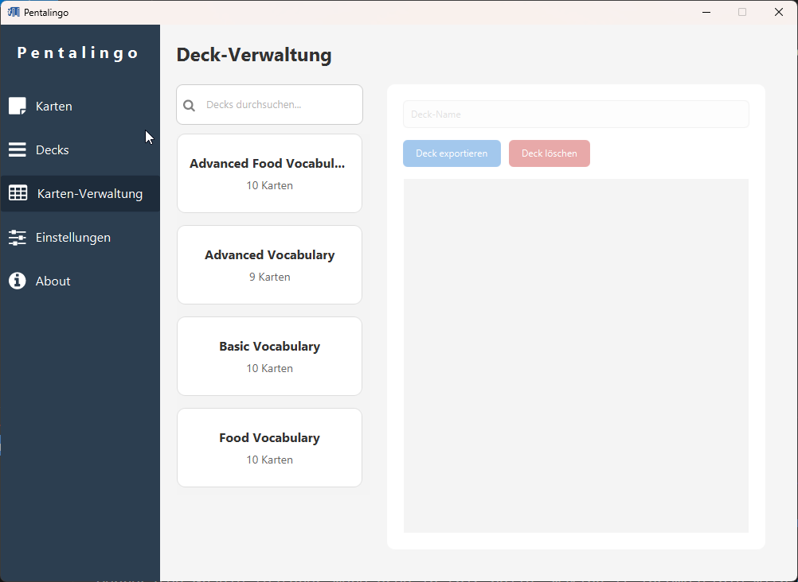

# Vocabulary Trainer (UNI Project)

A vocabulary trainer app built as a university project, designed to help users learn and test foreign language vocabulary in a structured way.

**NOTE:** This repo was originally created by a teammate, and I’m proud to have contributed and now maintain a copy here.

---

## 🎯 Purpose & Goals

- Provide a simple but effective way for learners to **practice vocabulary** with different modes (e.g. translation, multiple choice, etc.)  
- Support adding, editing, deleting vocabulary sets (words + translations)  
- Track user performance, show progress  
- Design with clarity and usability in mind  
- Use clean code standards and diagrams to support maintainability  

---

## 🧱 Features & Modules

The project includes (or aims to include) the following:

| Feature | Description |
|---|---|
| Vocabulary Management | Create / Edit / Delete vocabulary lists |
| Practice Modes | Translate words, multiple-choice quizzes, etc. |
| Progress Tracking | Show user statistics and successes/failures |
| UI / Design | Clean, minimal interface for ease of use |
| Documentation & Diagrams | UML diagrams, user manuals, and architecture docs |

---

## 📂 Repository Structure

Here’s a quick look at what you’ll find:
```markdown
.
├── src/ # Java source code
├── .idea/ # IDE configuration files (can ignore)
├── gradle/ # Gradle wrapper files
├── build.gradle.kts # Build script
├── settings.gradle.kts # Gradle settings
├── .gitignore
├── Aktivitäten-, Use-Case, Class Diagrams (drawio / png)
├── Benutzerhandbuch.docx # User manual
├── Pflichtenheft.docx # Requirements document
└── (other documentation, Excel files, etc.)
```

Feel free to browse the `.docx`, `.drawio`, and diagram files — they help explain the design decisions, user flows, and architecture.

---


# 🛠 Tech Stack

- **Language:** Java  
- **Build Tool:** Gradle  
- **IDE / Tools:** IntelliJ IDEA (or your preferred Java IDE)  
- **Documentation:** UML diagrams, Word docs  

---

## 👥 My Contribution & Role

During this university project, I was actively involved in several key areas:

- 💻 **Implementation:**  
  Developed core Java functionality for vocabulary practice logic (quiz, input validation, word matching, etc.)

- 🧩 **Integration:**  
  Helped connect different project modules, ensuring smooth cooperation between GUI and logic components

- 🧠 **Concept & Design:**  
  Contributed to designing the app structure and creating UML diagrams (Use Case & Activity diagrams)

- 🪶 **Documentation:**  
  Participated in writing and proofreading the *Benutzerhandbuch (User Manual)* and *Pflichtenheft (Requirements Document)*

- 🔍 **Testing & Debugging:**  
  Tested the app features, reported and fixed several logical bugs

- 🤝 **Team Collaboration:**  
  Worked closely with teammates to coordinate tasks, track progress, and make design decisions

> ⚡ *I focused on making the application stable, clean, and user-friendly — combining both technical and creative aspects of the project.*

---

## 🖼 Screenshots / Demo

### Main Menu

The start screen where users can choose a language or start a training session.



---


> 💡 *Note:*
> Create Deck


> 💡 *Note:*
> Manage Decks

---

**Localization & Improvements (Future Goals):**  
- 🌍 Plan to add **English language support**, improve **UI responsiveness**, and optimize the **user experience**

> 💡 *Note:*  
> - The project was mainly **developed on macOS** — it runs on Windows as well, but there might be **minor display issues with emojis** in some UI components.  
> - The application is currently **only available in German**, but adding **English localization** and other improvements is planned for the future.  


